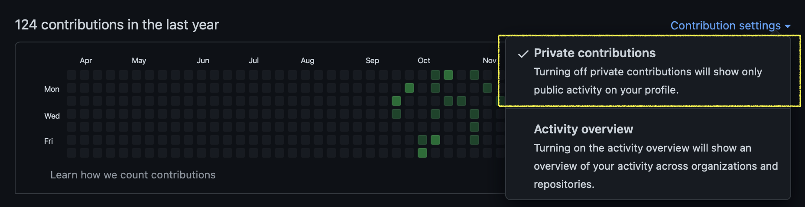

## Git

### private repository도 잔디에 반영하는 방법



<br>

## Django


### step 1. 장고 설치
```Shell
learn-django% conda create -n django // conda 가상환경 생성
learn-django% conda activate django
(django)learn-django% django-admin startproject coups_dev // 장고 프로젝트 생성 *이름 규칙
(django)learn-django% cd coups_dev
(django)learn-django/coups_dev% python manage.py migrate // DB 마이그레이션 *migrate 필요한 이유
(django)learn-django/coups_dev% python manage.py runserver // 개발서버 실행
```


### step 2. 프로젝트에 application 넣기
```
(django)learn-django/coups_dev% python manage.py startapp example // example 폴더 안에 views.py와 models.py 생성
```

--- example 애플리케이션 생성 ---

```
(django)learn-django/coups_dev% python manage.py runserver // host:port/ 페이지는 안만들었기때문에 오류남
```


### step 3. simple_poll 애플리케이션 생성 및 DB 마이그레이션 
```
(django)learn-django/coups_dev% python manage.py startapp simep_poll
```

--- simple_poll 애플리케이션 생성 ---

--- simple_poll 모델 생성 --- // coups_dev/settings.py에서 INSTALLED_APPS 수정

```
(django)learn-django/coups_dev% python manage.py makemigrations simple_poll // simple_poll 모델을 메인 앱에서 모델 수정 사항 기록
(django)learn-django/coups_dev% Python manage.py migrate // 애플리케이션 수정 사항을 프로젝트에 마이그레이션
```
마이그레이션(migrate) 시 사용하는 SQL 확인하려면 python manage.py sqlmigrate polls 변경기록번호 (ex: python manage.py sqlmigrate polls 0001)
	


### step 4. DB 데이터 추가

#### 1. admin 페이지에서 데이터 추가하는 방법
```Shell
(django)learn-django/coups_dev% python manage.py createsuperuser
Username (leave blank to use 'teki'):
Email address: lagunerio@gmail.com
Password: // 1234qwer
Password (again):
This password is too common.
Bypass password validation and create user anyway? [y/N]: y
Superuser created successfully.
```

--- 생성한 계정으로 admin 페이지 로그인 (teki/1234qwer) ---

--- simple_poll/admin.py에서 simple_poll/models.py에 생성한 함수를 등록 (ex: admin.site.register(함수명)) ---

--- 그 다음 admin 페이지에서 데이터 추가 가능 ---


#### 2. django shell 이용해서 데이터 추가하는 방법
```Shell
(django)learn-django/coups_dev% python manage.py shell // django shell 실행 명령어
```


### step 5. view 다루기
---  polls/view.py에 detail, results,vote view를 추가 ---

--- url에 연결 ---
