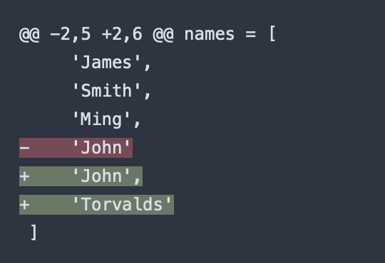
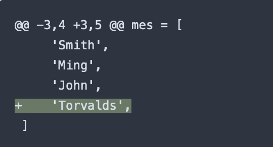

<<<<<<< HEAD
# 2022. 03. 30. 수 
=======
# 2022. 03. 30. 수
>>>>>>> 5d92bd37aedca7a52ff747882ba6993ba96c657b

## Python

### PEP 3107 - Function Annotations

#### parameters

```python
identifier [:expression] [= expression]
```

1. annotations for parameters take the form of optional expressions that follow the parameter name.
```python
def foo(a: expression, b: expression = 5):
    ...
```

2. annotations for excess parameters (i.e., ```*args``` and ```**kwargs```) are indicated similarly.
```python
def foo(*args: expression, **kwargs: expression):
    ...
```

3. annotations for nested parameters always follow the name of the parameter, not the last parenthesis. 
```python
def foo((x1, y1: expression),
        (x2: expression, y2: expression)=(None, None)):
    ...
```


### 콤마(,)

콤마를 사용하는 네 가지 목적

1. 다중값 사용

```python
a, b = 1, 2
```

2. 단일 튜플 사용

```python
(1)     // type: int
(1,)    // type: tuple
```

3. Trailing Comma

**<의의> VCS 관리 용이**

리스트 등 수정 시 콤마를 추가해야해서 두 줄을 수정하게 됨. 마지막에도 콤마를 붙일 수 있게 해서 필요한 줄만 trailing 가능해짐. (ex. git diff 실행 시 "한 줄을 수정했구나"가 가능)

```python
days_in_week = [
    'Mon',
    'Tue',
    'Wed',
    'Thi',
    'Fri',
    'Sat',
    'Sun',
]
```

###### Git VCS 예시

|without trailing comma|with trailing comma|
|:-:|:-:|
|||


4. 한 줄 출력

```python
#  without comma
for i in range(5):
    print i
"""
0
1
2
3
4
"""

# with comma
for i in range(5):
    print i,
"""
0 1 2 3 4
"""
```


<br>

## django

### Templates

settings.py에서 TEMPLATES 설정에 대한 이야기

**default:**
```python
TEMPLATES = []
```

**extends:**
```python
TEMPLATES = [
    {
        'BACKEND':  'django.template.backends.django.DjangoTemplates',  # default: not defined
        'DIRS':     [],     # default: []
        'APP_DIRS': True,   # default: False
        'OPTIONS':  {},     # default: {}
    }
]
```
1. BACKEND: template backend

- built-in template backends
    + 'django.template.backends.django.DjangoTemplates'
    + 'django.template.backends.jinja2.Jinja2'

- custom template backends
    + i.e. mypackage.whatever.Backend

2. DIRS: APP_DIRS보다 먼저 확인한다

3. APP_DIRS: True이면 installed applications의 템플릿도 확인한다.

4. OPTIONS: Built-in Backends 옵션 참

|option|default|description|
|--|--|--|
|'autoescape'|True|a boolean that controls whether HTML autoescaping is enabled.|
|'context_processors'|empty list|a list of dotted Python paths to callables that are used to populate the context when a template is rendered with a request. These callables take a request object as their argument and return a dict of items to be merged into the context.|
|'debug'|[DEBUG 설정](https://docs.djangoproject.com/en/2.2/ref/settings/#std:setting-DEBUG)|a boolean that turns on/off template debug mode.|
|'loaders'|[DIRS 설정](https://docs.djangoproject.com/en/2.2/ref/settings/#std:setting-TEMPLATES-DIRS)과 [APP_DIRS 설정](https://docs.djangoproject.com/en/2.2/ref/settings/#std:setting-TEMPLATES-APP_DIRS)]|a list of dotted Python paths to template loader classes.|
|'string_if_invalid'|empty string|the output, as a string, that the template system should use for invalid (e.g. misspelled) variables.|
|'file_charset'|'utf-8'.| the charset used to read template files on disk.|
|'libraries'|-|A dictionary of labels and dotted Python paths of template tag modules to register with the template engine.|
|...|...|...|


### Overriding Templates

장고에서 templates/ 디렉토리는 두 가지 타입이 있다.

1. ```{프로젝트 이름}/templates/```
2. ```{프로젝트 이름}/{앱 이름}/templates/```


#### 1. 프로젝트 템플릿에서 override: ```{프로젝트 이름}/templates/```

프로젝트 root 디렉토리에 templates 디렉토리가 있다는 것을 가정한다.

```
root/
    templates/
        app1/
            index.html
    app1/
        templates/
            app1/
                index.html
    app2/
        templates/
            app2/
                index.html
```

프로젝트의 템플릿으로 third-party 앱의 템플릿을 override하려는 경우 아래와 같이 설정할 수 있다.

```python
import os

BASE_DIR = os.path.dirname(os.path.dirname(os.path.abspath(__file__)))

INSTALLED_APPS = [
    ...,
    'blog',
    ...,
]

TEMPLATES = [
    {
        'BACKEND': 'django.template.backends.django.DjangoTemplates',
        'DIRS': [os.path.join(BASE_DIR, 'templates')],
        'APP_DIRS': True,
        ...
    },
]
```


#### 2. 앱 템플릿에서 override: ```{프로젝트 이름}/{앱 이름}/templates/{앱 이름}```

프로젝트 root 디렉토티에 templates 디렉토리가 없을 수 있다.

```
root/
    app1/
        templates/
            app1/
                index.html
    app2/
        templates/
            app2/
                index.html
```

그래도 다른 앱의 template으로 override할 수 있다.

TEMPLATES 설정에서 APP_DIRS를 True로 설정해주면 된다.

```python
TEMPLATES = [
    {
        ...,
        'APP_DIRS': True,
        ...
    },
]
```

###### # 일반적인 템플릿 디렉토리 구조가 ```{앱 폴더 이름}/templatess/{앱 폴더 이름}/index.html```인 이유

앱 app1과 앱 app2에 대해 두 앱에서 모두 index.html이라는 템플릿을 가지고 있을 때, app1에서 index.html 템플릿을 차는 상황을 가정하자.
만약 app1이 ```app1/templates/index.html```를 못찾으면 ```app2/templates/index.html```을 찾는다.
```app1/templates/app1/index.html```과 ```app2/templates/app2/index.html``` 구조로 저장한다면 그런 문제를 방지할 수 있다.

- 참고: [Django App Templatess Directory. 장고 앱 템플릿 디렉토리 구조에 대해](https://senticoding.tistory.com/77)

###  태그

view에서 url을 동적으로 사용하는 방법.

**포맷:**
```html

```
- 뷰_이름: simple_poll/urls.py에서 설정한 path의 이름
- 인풋_변수이름: url에 들어갈 변수

**사용 예:**
```html
# 하드코딩
<li><a href="/polls/{{ question.id }}/"></a></li>
# 동적코딩
<li><a href="{ url 'detail' question.id}" /></li>
```

