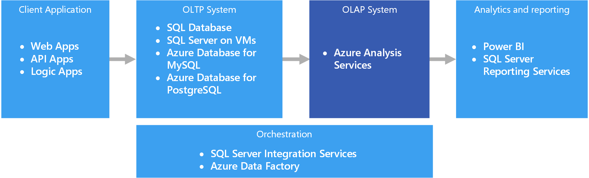

# 2022. 04. 01. 금

## OLAP 정의

OLAP (On-Line Analytical Processing)

#### [위키피디아](https://en.wikipedia.org/wiki/Online_analytical_processing)

- MDA(Multi-Demensional Analytical) 쿼리에 빠르게 응답하기 위한 접근법
- 기존 데이터베이스 용어인 OLTP(On-Line Transaction Processing)에서 파생한 용어
- BI의 일부로, relational DB, 레포트 작성, 데이터 마이닝 등을 포함
- 일반적인 OLAP 애플리케이션은 다음을 포함: business reporting for sales, marketing, management reporting, business process management (BPM), budgeting and forecasting, financial reporting and similar areas, with new applications emerging, such as agriculture.

#### [Microsoft](https://docs.microsoft.com/en-us/azure/architecture/data-guide/relational-data/online-analytical-processing)

- 비즈니스에서 사용하는 트랜잭션, 레코드 등을 저장하는 데이터베이스
- 한 번에 하나씩 입력되는 특성을 가지는 레코드를 저장




<br>

## OLAP vs. OLTP

<table>
  <tr>
    <td></td>
    <td>OLTP</td>
    <td>OLAP</td>
  </tr>
  <tr>
    <td>Full name</td>
    <td>On-Line Transaction Processing</td>
    <td>On-Line Analytical Processing</td>
  </tr>
  <tr>
    <td>정의</td>
    <td>최종 사용자가 정보에 직접 접근해<br>대화식으로 정보를 분석하고<br>의사결정에 활용하는 과정</td>
    <td>효율적인 기업 운영을 지원하기 위해<br>트랜잭션을 수집하고 분류, 저장, 유지보수,<br>갱신, 검색하는 기능을 수행하는<br>실시간 거래 처리 시스템 (기간시스템)</td>
  </tr>
  <tr>
    <td>관계</td>
    <td colspan="2">OLAP는 OLTP를 활용하는 방법</td>
  </tr>
</table>


<br>

## OLAP 분류

#### [1] Multidemensianl OLAP (MOLAP)

#### [2] Relational OLAP (ROLAP)

#### [3] Hybrid OLAP (HOLAP)

<br>

## Python Docstring

- 참고: https://wikidocs.net/16050
- 참고: https://doorbw.tistory.com/231

#### Docstring 작성

Module의 첫번째 줄, 함수 선언 바로 아래 줄, 또는 클래스 선언 바로 아래 줄에 큰따옴표 또는 작은 따옴표 3개로 작성

ex:
```Python
"""
    URL로부터 파일을 가져와 단어를 print 함.
Usage:
    python words.py <URL>
"""
from words import fecth_words

class CustomClass:
    """
    클래스의 문서화 내용을 입력합니다.    
    """
    def custom_function(param):
        '''
        함수의 문서화 내용을 입력합니다.
        '''
        ... 코드  ...
```

#### Docstring 확인

객체의 ```__doc__``` 속성을 출력하여 확인

ex:
```Python
print(len.__doc__)
```

<br>

## Coding Style: EAFP vs LBYL
ft. PEP 463 - Exception-catching expressions

|:--:|--|
|EAFP|Easier to Ask Forgiveness than Permission|
|LBYL|Look Before You Leap|

#### [1] LBYL

C is using the LBYL principle

```Python
if key in dic:
    process(dic[key])
else:
    process(None)

# As an expression:
process(dic[key] if key in dic else None)
```

#### [2] EAFP

python is using the EAFP principle

```Python
try:
    process(dic[key])
except KeyError:
    process(None)

# As an expression:
process(dic[key] except KeyError: None)
```